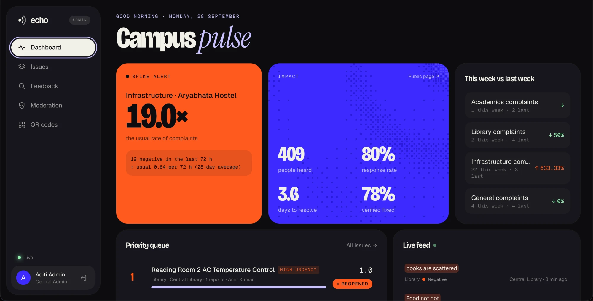
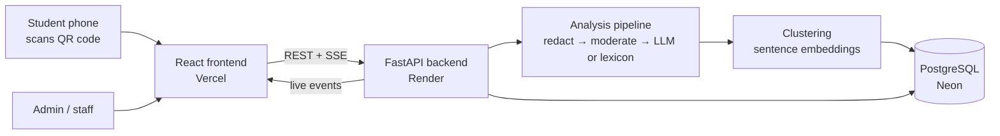

# Echo

**Every voice gets an answer.** A closed-loop campus feedback platform: students scan a QR code where a problem happens, AI turns their words into issues someone owns, staff answer in public, and the people who reported it confirm whether it actually got fixed.

**Live:** [echo.skipp.life](https://echo.skipp.life) · Vision2Web Full Stack Hackathon · Problem Statement 2 (Smart Feedback Analyzer)


## Contents

- [How it works](#how-it-works)
- [Features](#features)
- [Screenshots](#screenshots)
- [Tech stack](#tech-stack)
- [Architecture](#architecture)
- [Project structure](#project-structure)
- [Running locally](#running-locally)
- [Deployment](#deployment)
- [API overview](#api-overview)
- [Testing](#testing)
- [Team](#team)

## How it works

1. **Scan and report.** Every location has its own QR code. Scanning opens a form for that place, with its known issues listed so people can tap **Me too** instead of retyping.
2. **Understand.** Each report is redacted (phone numbers and emails removed), moderated, and split into aspects by an LLM: topic, category, sentiment and urgency. If the LLM is unavailable, a built-in lexicon analyzer takes over, so no report is lost.
3. **Group into issues.** Negative aspects are clustered with similar open issues at the same place using sentence embeddings, so 20 reports about the same Wi-Fi outage become one issue.
4. **Prioritize.** Each issue gets a transparent score, **Rw × N × U**: recency-weighted reports × share negative × urgency. Admins see why an issue ranks where it does.
5. **Resolve in public.** Staff move issues through *acknowledged → in progress → resolved* and must write a public response to resolve.
6. **Verify.** The people who reported it are asked whether it's actually fixed. If 30% or more say no (minimum 3 votes), the issue reopens automatically.

## Features

**For students (no account needed)**
- Location QR codes that open a prefilled feedback form
- One-tap **Me too** on existing issues
- A tracking code for every report, with a status timeline and the public response
- Fix verification: vote *fixed* or *not fixed* once an issue is resolved
- A public transparency page with response rate, time to resolve and verified-fix rate

**For admins and staff**
- Dashboard with spike alerts, week-over-week trends, a priority queue and a live feed
- Issue detail with the priority breakdown, evidence from reports, audit trail and assignment
- Moderation queue for spam, gibberish and abuse (redact and keep, approve or reject)
- Feedback search with sentiment, topic, location and date filters
- Printable, full-screen QR codes for every location
- Live updates over server-sent events
- Role-based access: staff only see the issues assigned to them

**Safety and privacy**
- PII redaction before anything is stored; profanity is masked, not rejected
- Prompt-injection-resistant LLM prompt, with a lexicon fallback
- Flagged feedback stays out of issues until an admin approves it
- Only reporters of an issue, who reported before the fix, can verify it, once per fix

## Screenshots

### Admin dashboard
Spike alerts, impact numbers, week-over-week trends, the priority queue and a live feed of incoming feedback.



### QR codes for every location
Each place gets a code. **Present** shows it full screen for printing or display; scanning opens the feedback form for that location.


## Tech stack

| Layer | Technology |
|---|---|
| Frontend | React 19, Vite, TypeScript, Tailwind CSS 4, GSAP, React Router |
| Backend | FastAPI, SQLAlchemy 2, Alembic, Pydantic |
| Database | PostgreSQL (Neon) |
| AI analysis | Groq (Qwen by default; xAI Grok or Gemini also supported), VADER lexicon fallback |
| Clustering | fastembed (all-MiniLM-L6-v2 sentence embeddings) |
| Auth | JWT (python-jose) with bcrypt password hashing |
| Live updates | Server-sent events |
| Hosting | Vercel (frontend), Render (backend), Neon (database) |

## Architecture



The backend runs in the same AWS region as the database (us-east-2), and pages load their independent queries in parallel, so admin pages respond in well under a second.

## Project structure

```
backend/
  app/
    main.py          app setup, CORS, startup tasks (connection warm-up, priority refresh)
    models.py        SQLAlchemy models: users, locations, feedback, aspects, issues, events, verifications
    auth.py          login, JWT, role checks
    routers/         public, issues, admin, stream (SSE), ask (natural-language filters)
    services/        analysis, llm, fallback, moderation, redact, cluster, priority,
                     lifecycle (issue linking, rescoring, verification rounds), spikes, stats
    seed.py          demo data (python -m app.seed)
  alembic/           database migrations
  tests/             pytest suite
frontend/
  src/pages/landing/ landing page sections
  src/pages/public/  Submit, Track, Transparency, Report
  src/pages/admin/   Login, Dashboard, Issues, IssueDetail, Feedback, Moderation, QRCodes
  src/lib/           API client, auth, live updates, types
  src/mocks/         in-memory mock API (VITE_USE_MOCKS=true)
docs/                team plan and screenshots
render.yaml          Render blueprint for the backend
```

## Running locally

**Requirements:** Python 3.12+, Node 20.19+ (or 22.12+), and a PostgreSQL database (a free [Neon](https://neon.tech) project works).

### Backend

```bash
cd backend
python3 -m venv .venv
source .venv/bin/activate
pip install -r requirements.txt
cp .env.example .env        # then fill in DATABASE_URL, JWT_SECRET and GROQ_API_KEY
alembic upgrade head        # create the tables
python -m app.seed          # demo data, accounts and the ECH-DEMO report
uvicorn app.main:app --reload --port 8000
```

| Variable | Purpose |
|---|---|
| `DATABASE_URL` | PostgreSQL connection string |
| `JWT_SECRET` | Secret for signing login tokens |
| `GROQ_API_KEY` | LLM analysis (optional: without any key, the lexicon analyzer is used) |
| `GROQ_MODEL` | Optional model override (default `qwen/qwen3.8-27b`) |
| `XAI_API_KEY`, `GEMINI_API_KEY` | Alternative LLM providers, used if no Groq key is set |
| `CORS_ORIGINS` | Comma-separated frontend URLs allowed to call the API |

### Frontend

```bash
cd frontend
npm install
cp .env.example .env
npm run dev                 # http://localhost:5180
```

| Variable | Purpose |
|---|---|
| `VITE_USE_MOCKS` | `true` runs on an in-memory mock API (no backend needed); `false` uses the real backend |
| `VITE_API_URL` | Backend URL, e.g. `http://localhost:8000` |
| `VITE_PUBLIC_URL` | Public site address used in QR codes; set it to the deployed URL so phones can open them |

### Demo accounts

The seed script creates these accounts, all with the password `demo1234`:

| Email | Role |
|---|---|
| `admin@echo.edu` | Admin |
| `rahul.wifi@echo.edu` | Staff, IT/Wi-Fi |
| `priya.mess@echo.edu` | Staff, Mess |
| `amit.hostel@echo.edu` | Staff, Hostel |

The staff console is at `/admin`. To see the fix-verification screen without submitting anything, open `/track/ECH-DEMO`.

## Deployment

| Part | Host | Notes |
|---|---|---|
| Frontend | Vercel | Root directory `frontend`; `vercel.json` rewrites routes to the SPA. Set `VITE_API_URL`, `VITE_USE_MOCKS=false` and `VITE_PUBLIC_URL`. |
| Backend | Render | `render.yaml` blueprint in the Ohio region, next to the database. Set `DATABASE_URL`, `GROQ_API_KEY` and `CORS_ORIGINS`. |
| Database | Neon | PostgreSQL in AWS us-east-2 |

On Render's free plan the backend sleeps after 15 minutes idle. An uptime monitor that requests `/` every 10 minutes keeps it awake.

## API overview

All routes are under `/api`. Errors share one shape: `{"error": {"code", "message", "fields"}}`.

| Area | Endpoints |
|---|---|
| Public | `GET /locations/public`, `GET /locations/{slug}`, `GET /locations/{slug}/issues`, `POST /feedback`, `POST /issues/{id}/metoo`, `GET /track/{code}`, `POST /track/{code}/verify`, `GET /public/stats`, `GET /public/issues`, `GET /public/ticker` |
| Auth | `POST /auth/login`, `GET /auth/me` |
| Issues | `GET /issues`, `GET /issues/{id}`, `PATCH /issues/{id}`, `GET /users` |
| Admin | `GET /dashboard/summary`, `GET /analytics/summary`, `GET /alerts`, `GET /feedback`, `GET /moderation/queue`, `PATCH /feedback/{id}/moderation` |
| Live | `GET /stream` (server-sent events, admins only) |
| Search | `POST /ask` (turns a natural-language question into filters) |

Interactive API docs are served at `/docs` on the backend.

## Testing

```bash
cd backend
source .venv/bin/activate
pytest
```

The suite covers redaction, moderation, the lexicon analyzer, clustering, priority scoring, spike detection, and the API rules for moderation, fix verification, input validation and error responses. The API tests run against a throwaway in-memory SQLite database, never the one in `.env`.

## Team

| Area | Owner |
|---|---|
| Frontend | Nikhil |
| Backend: analysis & intelligence | Aaditya |
| Backend: platform API & data | Aditi |
